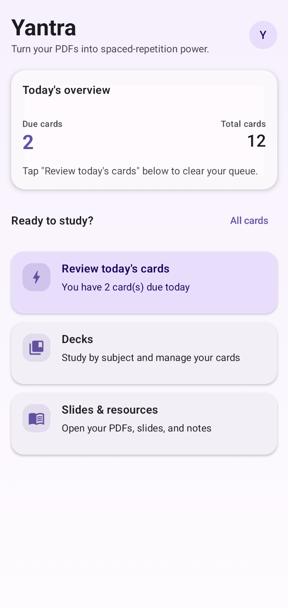
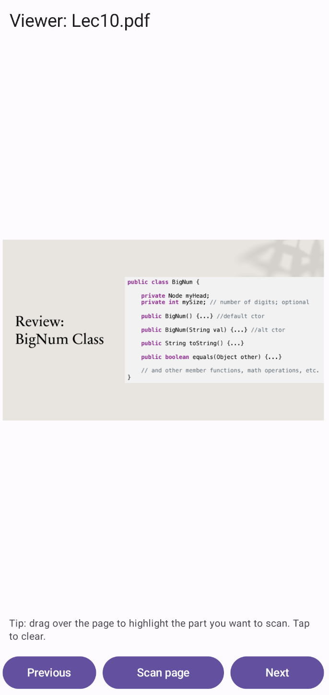
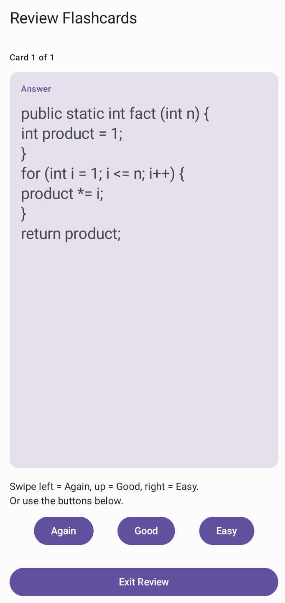

<div align="center">


# Yantra 📚

> Turn your PDFs, slides, and notes into spaced-repetition power.


[](https://opensource.org/licenses/MIT)

**Yantra** is a student-focused Android app that streamlines the process of turning study materials into **flashcards with spaced repetition**.

**Workflow:** import slides or handouts → highlight a region → OCR the text → save as a card → review later.

[Features](#-features) • [How It Works](#-how-it-works) • [Installation](#-getting-started) • [Roadmap](#-roadmap) • [Contributing](#-contributing)

</div>

---

## 🧭 Table of Contents

- [Screenshots](#-screenshots)
- [Features](#-features)
- [Why Yantra?](#-why-yantra)
- [How It Works](#-how-it-works)
- [Screens & UX](#-screens--ux)
- [Tech Stack](#-tech-stack)
- [Project Structure](#-project-structure)
- [Performance & Requirements](#-performance--requirements)
- [Getting Started](#-getting-started)
- [Usage Guide](#-usage-guide)
- [Roadmap](#-roadmap)
- [Contributing](#-contributing)
- [Known Issues](#-known-issues)
- [Acknowledgments](#-acknowledgments)
- [License](#-license)

---

## 📸 Screenshots

<div align="center">

| Home Screen | PDF Viewer | Flashcard Review |
|-------------|------------|------------------|
|  |  |  |

</div>

---

## ✨ Features

### For learners

- 📥 **Import study materials**
  - PDFs: lecture slides, notes, handouts.
  - In-app viewer focused on reading and capturing key ideas.

- ✍️ **Drag-to-highlight → OCR → flashcard**
  - Drag over a region of the PDF to highlight it.
  - OCR only that region (or the whole page if no selection).
  - Convert the extracted text into a flashcard.

- 🧠 **Spaced-repetition-style review**
  - "Today's overview" concept for due cards.
  - One-tap review flow for cards that need attention.

- 🗂 **Deck-based organization**
  - Create decks for subjects/topics.
  - Assign cards to decks.
  - Review by deck or across all decks.

---

## 🎯 Why Yantra?

Students often have hundreds of slides and handouts but struggle to retain the content.

Common problems:
- ❌ Re-reading slides is passive and low-impact.
- ❌ Manually typing flashcards from PDFs is slow.
- ❌ Generic flashcard apps don't integrate well with your actual study materials.

**Yantra** combines **PDF viewing**, **OCR**, and **flashcards** so you can go from *slide → highlight → card* in a few seconds.

---

## 🔄 How It Works

1. **Open a PDF**  
   The page is rendered using Android's `PdfRenderer` into a bitmap.

2. **Highlight what matters**  
   Drag on the page to create a selection rectangle over the key text.

3. **Crop & OCR**  
   - The selected area (view coordinates) is mapped to the underlying bitmap.
   - That region is cropped and passed to **ML Kit Text Recognition**.

4. **Create a flashcard**  
   - OCR text is used for the card back.
   - You add or edit the question/prompt for the front.

5. **Review later**  
   Cards are stored with their decks. The review flow lets you come back to them in focused study sessions.

---

## 🖼 Screens & UX

### 🏠 Home

- Title and short description.
- "Today" overview idea for surfacing cards that need review.
- Primary actions like:
  - **Review Today's Cards**
  - **Start Study Session**
- Quick access to:
  - Decks
  - Slides & Resources (PDFs)

*(Exact layout may evolve as the app is iterated.)*

### 📄 PDF Viewer

- Page rendering via `PdfRenderer`.
- Drag-to-highlight overlay on top of the page.
- **Scan area** when a selection exists.
- **Scan page** when there's no selection.
- Page navigation:
  - **Previous**
  - **Next**

### 🃏 Flashcard Creation

- **Front**: your question/prompt.
- **Back**: OCR text (editable).
- Optional deck selection (if you organize by subject).

### 🗂 Decks & Review

- Create and manage decks.
- View and edit cards.
- Review cards in a simple, focused screen.

---

## 🧱 Tech Stack

- **Language:** Kotlin  
- **UI:** Jetpack Compose + Material 3  
- **Architecture:** MVVM (ViewModel + state holders)  
- **OCR:** Google ML Kit Text Recognition  
- **PDF Rendering:** Android `PdfRenderer`  
- **Persistence:** Room / SQLite (for decks and flashcards)  
- **Navigation:** Jetpack Navigation Compose  

---

## 🗂 Project Structure

```text
app/
└── src/main/java/com/example/yantra/
    ├── data/
    │   ├── model/            # Deck, Flashcard entities
    │   └── repository/       # PDF, Deck, and Flashcard repositories
    │
    ├── ui/
    │   ├── home/             # Home screen / dashboard
    │   ├── viewer/           # PDF viewer (highlight + OCR)
    │   ├── deck/             # Deck management screens + ViewModel
    │   └── flashcard/        # Flashcard ViewModel + review / creation
    │
    └── ...                   # Navigation, theming, app entry point
```

---

## 📊 Performance & Requirements

> These are general guidelines; see `app/build.gradle` for the actual `minSdk` / `targetSdk` values.

- Android device that meets the app's configured minimum SDK version.
- Sufficient free storage for:
  - The app itself.
  - Cached PDFs and OCR processing.
- **Google Play Services** available on the device (needed for ML Kit OCR).
- Performance depends on device; typical OCR runs quickly on modern phones.

Language support is provided by ML Kit Text Recognition for multiple Latin-script languages. Actual accuracy can vary with font, layout, scan quality, and language.

---

## 🚀 Getting Started

You can install an APK directly, or build the app from source.

### Option 1: Install APK

> Once you publish Releases on GitHub, update the link here.

1. Download the latest `yantra-*.apk` from the **Releases** page.
2. Copy it to your Android device or download it directly on the device.
3. On your device:
   - Go to **Settings → Security** (or Apps & notifications → Special access).
   - Allow installing apps from unknown sources if prompted.
4. Open the APK via your Files app and install.
5. Launch **Yantra** from the app drawer.

### Option 2: Build from Source

#### Prerequisites

- Android Studio (Giraffe / Hedgehog or newer recommended).
- Kotlin plugin enabled.
- Android SDK installed (matching the project's `minSdk` / `targetSdk`).
- A device or emulator with **Google Play Services**.

#### Clone the repo

```bash
git clone https://github.com/your-username/yantra.git
cd yantra
```

*(Use your actual GitHub username and repo name.)*

#### Build & run

1. Open the project in **Android Studio**.
2. Let Gradle sync and download dependencies.
3. Connect a device or start an emulator.
4. Run the `app` configuration.

#### Generate an APK via CLI

```bash
./gradlew assembleDebug
# or
./gradlew assembleRelease
```

The APK will be located at:

```text
app/build/outputs/apk/<buildType>/
```

---

## 🎓 Usage Guide

### Creating Cards from a PDF

1. Open a PDF from the app's "Slides & Resources" / documents section.
2. Drag across the text you want to capture; a highlight rectangle will appear.
3. Tap **Scan area** to OCR the selected region – or **Scan page** if no area is selected.
4. Review the OCR text in the flashcard dialog (back side).
5. Write or adjust the question/prompt (front side).
6. Optionally assign it to a deck.
7. Save the flashcard.

### Reviewing Cards

- Navigate to the review flow (e.g., from Home or Decks).
- Go through the cards one by one.
- Use the current rating / next-card controls provided in the UI.
- Cards you've created will show up again in future sessions based on the app's scheduling logic.

*(The exact review algorithm may evolve as the project grows.)*

---

## 🛣 Roadmap

Planned / possible future work:

- [ ] 🔁 More advanced and tunable spaced-repetition algorithms.
- [ ] 🌙 Dark mode / focus mode.
- [ ] 🔎 Search inside PDFs and better navigation.
- [ ] 📊 Per-deck statistics (accuracy, streaks, progress).
- [ ] ☁️ Optional sync / backup.
- [ ] 📝 Inline editing of cards directly from the PDF viewer.

You can track progress via GitHub Issues or a separate `ROADMAP.md` file.

---

## 🤝 Contributing

Contributions are welcome!

1. **Fork** this repository.

2. Create a feature branch:
   ```bash
   git checkout -b feature/my-idea
   ```

3. Make your changes and commit:
   ```bash
   git commit -m "Add my idea"
   ```

4. Push your branch:
   ```bash
   git push origin feature/my-idea
   ```

5. Open a **Pull Request** describing your changes.

---

## 🐛 Known Issues

- OCR quality depends on PDF quality (low resolution → worse results).
- Handwriting and complex formulas are harder for OCR to parse.
- Very large PDFs may take longer to render and navigate.

Please report problems or edge cases via GitHub Issues.

---

## 🙏 Acknowledgments

- [Google ML Kit](https://developers.google.com/ml-kit) for on-device OCR.
- [Jetpack Compose](https://developer.android.com/jetpack/compose) for declarative UI.
- [Material Design 3](https://m3.material.io/) for design guidelines.

---

## 📜 License

```text
MIT License

Copyright (c) 2025 Saurab Gyawali

Permission is hereby granted, free of charge, to any person obtaining a copy
of this software and associated documentation files (the "Software"), to deal
in the Software without restriction, including without limitation the rights
to use, copy, modify, merge, publish, distribute, sublicense, and/or sell
copies of the Software, and to permit persons to whom the Software is
furnished to do so, subject to the following conditions:

The above copyright notice and this permission notice shall be included in all
copies or substantial portions of the Software.

THE SOFTWARE IS PROVIDED "AS IS", WITHOUT WARRANTY OF ANY KIND, EXPRESS OR
IMPLIED, INCLUDING BUT NOT LIMITED TO THE WARRANTIES OF MERCHANTABILITY,
FITNESS FOR A PARTICULAR PURPOSE AND NONINFRINGEMENT. IN NO EVENT SHALL THE
AUTHORS OR COPYRIGHT HOLDERS BE LIABLE FOR ANY CLAIM, DAMAGES OR OTHER
LIABILITY, WHETHER IN AN ACTION OF CONTRACT, TORT OR OTHERWISE, ARISING FROM,
OUT OF OR IN CONNECTION WITH THE SOFTWARE OR THE USE OR OTHER DEALINGS IN THE
SOFTWARE.
```

---

<div align="center">

**Made with ❤️ for students everywhere**

[⬆ Back to Top](#yantra-)

</div>
